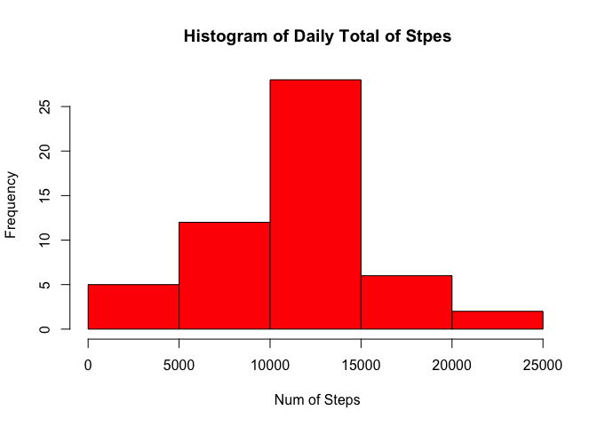
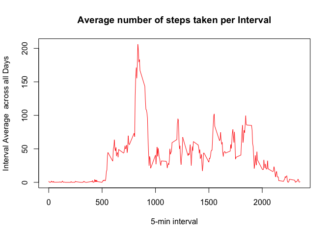
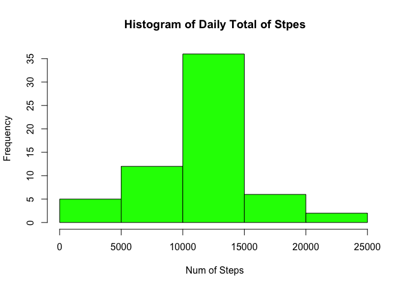

# Reproducible Research: Peer Assessment 1


## Loading and preprocessing the data

```r
library(dplyr)
```

```
## 
## Attaching package: 'dplyr'
## 
## The following objects are masked from 'package:stats':
## 
##     filter, lag
## 
## The following objects are masked from 'package:base':
## 
##     intersect, setdiff, setequal, union
```

```r
activity_data =read.csv("/Users/phukkoo/coursera_reproduceres/project1/activity.csv")
head(activity_data)
```

```
##   steps       date interval
## 1    NA 2012-10-01        0
## 2    NA 2012-10-01        5
## 3    NA 2012-10-01       10
## 4    NA 2012-10-01       15
## 5    NA 2012-10-01       20
## 6    NA 2012-10-01       25
```

```r
names(activity_data)
```

```
## [1] "steps"    "date"     "interval"
```

```r
activity_data_total <- aggregate(steps ~ date, data = activity_data, sum, na.rm = TRUE)
hist(activity_data_total$steps, col = "red",main = " Histogram of Daily Total of Stpes", xlab = " Num of Steps", ylab = "Frequency" )
```

 


## What is mean total number of steps taken per day?

```r
mean(activity_data_total$steps)
```

```
## [1] 10766.19
```

```r
median(activity_data_total$steps)
```

```
## [1] 10765
```


## What is the average daily activity pattern?

```r
activity_data_avg_by_interval <- aggregate(steps ~ interval, data = activity_data, mean, na.rm = TRUE)
head(activity_data_avg_by_interval)
```

```
##   interval     steps
## 1        0 1.7169811
## 2        5 0.3396226
## 3       10 0.1320755
## 4       15 0.1509434
## 5       20 0.0754717
## 6       25 2.0943396
```

```r
plot(activity_data_avg_by_interval$interval, activity_data_avg_by_interval$steps, type = "l", xlab = "5-min interval", 
     ylab = "Interval Average  across all Days", main = "Average number of steps taken per Interval", 
     col = "red")
```

 
### Which 5-minute interval, on average across all the days in the dataset, contains the maximum number of steps?

```r
activity_data_avg_by_interval[which.max(activity_data_avg_by_interval$steps),]
```

```
##     interval    steps
## 104      835 206.1698
```


## Imputing missing values
###  Calculate and report the total number of missing values in the dataset (i.e. the total number of rows with NAs)

```r
activity_data_NA <- sum(is.na(activity_data))
```

```r
### num of missing values
activity_data_NA 
```

```
## [1] 2304
```

```r
merge_activity_data <- merge(activity_data, activity_data_avg_by_interval, by.x = "interval", by.y = "interval",all.x=TRUE)  
dim(activity_data_avg_by_interval)
```

```
## [1] 288   2
```

```r
dim(merge_activity_data)
```

```
## [1] 17568     4
```

```r
dim(activity_data)
```

```
## [1] 17568     3
```

```r
head(merge_activity_data )
```

```
##   interval steps.x       date  steps.y
## 1        0      NA 2012-10-01 1.716981
## 2        0       0 2012-11-23 1.716981
## 3        0       0 2012-10-28 1.716981
## 4        0       0 2012-11-06 1.716981
## 5        0       0 2012-11-24 1.716981
## 6        0       0 2012-11-15 1.716981
```

```r
merge_activity_data$new_steps <- ifelse(is.na(merge_activity_data$steps.x), merge_activity_data$steps.y,merge_activity_data$steps.x)
head(merge_activity_data )
```

```
##   interval steps.x       date  steps.y new_steps
## 1        0      NA 2012-10-01 1.716981  1.716981
## 2        0       0 2012-11-23 1.716981  0.000000
## 3        0       0 2012-10-28 1.716981  0.000000
## 4        0       0 2012-11-06 1.716981  0.000000
## 5        0       0 2012-11-24 1.716981  0.000000
## 6        0       0 2012-11-15 1.716981  0.000000
```

```r
merge_activity_data_total <- merge_activity_data %>% 
        group_by(date)  %>%
        summarise(total_daily_steps = sum(new_steps ))
hist(merge_activity_data_total$total_daily_steps, col = "green",main = " Histogram of Daily Total of Stpes", xlab = " Num of Steps", ylab = "Frequency" )
```

 

```r
mean(merge_activity_data_total$total_daily_steps)
```

```
## [1] 10766.19
```

```r
median(merge_activity_data_total$total_daily_steps)
```

```
## [1] 10766.19
```


## Are there differences in activity patterns between weekdays and weekends?


```r
library(chron)
merge_activity_data$weekend = chron::is.weekend(merge_activity_data$date)
merge_activity_data$type_of_day <- ifelse(merge_activity_data$weekend, "WEEKEND","WEEKDAY")

ts_data1 <- merge_activity_data %>% 
        group_by(interval,type_of_day)  %>%
        summarise(avg_steps_per_interval = mean(new_steps ))
library(lattice)
xyplot(  ts_data1$avg_steps_per_interval ~ ts_data1$interval |  ts_data1$type_of_day, type = "l", layout = c(1, 2), ylab = " Number of Steps", 
     xlab = "Interval")
```

 
